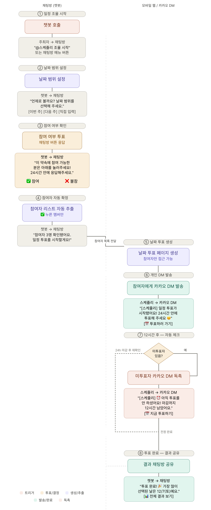

# Scheduly

카카오톡 단체채팅방에서 `@스케쥴리`를 멘션하는 것만으로 일정을 자동으로 조율해주는 카카오톡 챗봇입니다.

"언제 만날지" 정하는 것부터 "몇 시에 만날지" 정하는 것까지, 참여자 모으기 → 날짜 투표 → 시간 투표 → 확정까지의 전 과정을 자동화합니다.

## ✨ 주요 기능

- **참여자 수집**: "@스케쥴리 시작"으로 일정 조율을 시작하면, 24시간 동안 "참여" 버튼을 누른 사람만 참여자로 등록
- **날짜 투표**: 모인 참여자들에게 날짜별 투표 링크 공유, 우선순위 기반으로 순위 집계
- **시간 투표**: 날짜가 확정되면 이어서 구체적인 시간까지 2차 투표
- **자동 리마인더**: 미투표자에게 시간 경과에 따라 톤이 달라지는 독촉 알림 자동 발송 (30분 → 2시간 → 6시간 → 12시간 → 최후통첩 → 자동 확정)
- **카카오톡 그룹챗 능동 알림**: 카카오 Event API를 통해 봇이 먼저 채팅방에 현황/완료 메시지를 발송
<div align="center">
  
</div>


## 🛠 기술 스택

- **Backend**: Java, Spring Boot (Spring Web, Spring Data JPA, Spring Security, Spring Session)
- **DB**: PostgreSQL
- **Build**: Gradle
- **배포**: AWS EC2, GitHub Actions (CI/CD)
- **외부 연동**: 카카오 i 오픈빌더 (팀채팅 챗봇 스킬 서버), 카카오 Bot API (Event API)

## 🗂 프로젝트 구조
레이어별 역할은 다음과 같다.

```
controller/   HTTP 요청 진입점. 카카오 스킬 요청(KakaoSkillController), 투표/참여자 REST API
service/      비즈니스 로직. 세션 상태 관리, 투표 생성/집계, 카카오 알림 발송
scheduler/    시간 기반 자동 처리. 참여자 수집 타이머, 리마인더/독촉 스케줄
entity/       JPA 엔티티 (Vote, Participant, PendingSession, TimePoll 등)
repository/   Spring Data JPA 리포지토리
dto/          요청/응답 DTO
```

## 📡 API 문서

- [`/kakao` 카카오 스킬 API](./docs/api/kakao_api.md)
- [`/votes` 투표 API](./docs/api/vote_api.md)
- [`/participants` 참여자 API](./docs/api/participant_api.md)

---

## 🧩 Git 컨벤션

### 전체 과정

| 단계 | 설명 | 예시 |
|---|---|---|
| 1️⃣ 이슈 생성 | 작업 정의 및 라벨 지정 | `[Feature] 로그인 API 추가` |
| 2️⃣ 브랜치 생성 | 이슈 번호 기반 브랜치 생성 | `feature/#12` |
| 3️⃣ 커밋 | 컨벤션에 맞게 메시지 작성 | `feat: 로그인 API 구현` |
| 4️⃣ PR 생성 | `develop` 브랜치 대상으로 PR 생성 | `Closes #12` |

### (1) 커밋 메시지 규칙

| 타입 | 설명 |
|---|---|
| `feat` | 새로운 기능 추가 |
| `fix` | 버그 수정 |
| `docs` | 문서 수정 |
| `style` | 코드 포맷팅, 세미콜론 등 (로직 변경 없음) |
| `refactor` | 코드 리팩토링 |
| `test` | 테스트 코드 추가 |
| `chore` | 빌드, 패키지 관리, 파일 삭제 등 기타 작업 |
| `hotfix` | 긴급한 버그 수정 |

**예시**
```
feat: 회원가입 API 구현
fix: 잘못된 토큰 검증 로직 수정
docs: README 배포 절차 추가
```

### (2) 브랜치 관리 전략 (Git Flow)

| 브랜치 | 용도 |
|---|---|
| `main` | 배포 환경 |
| `develop` | 개발 통합 환경 |
| `hotfix/*` | 긴급한 버그 수정 |
| `feat/#이슈번호` | 새로운 기능 개발 시 사용 |

**예시**: `feat/#12`, `fix/#45`

## 🧾 Issue 컨벤션

### 이슈 제목 규칙

| 유형 | 예시 제목 |
|---|---|
| `[Feature]` | `[Feature] 회원관리 기능 추가` |
| `[Fix]` | `[Fix] 토큰 만료 예외 처리 수정` |
| `[Documentation]` | `[Documentation] API 명세 문서 업데이트` |
| `[Refactor]` | `[Refactor] Service 레이어 구조 개선` |
| `[Test]` | `[Test] MidpointService 단위 테스트 추가` |
| `[Chore]` | `[Chore] 불필요한 로그 삭제` |
| `[Hotfix]` | `[Hotfix] 배포 환경 DB 설정 오류 수정` |
| `[Security]` | `[Security] JWT 토큰 암호화 방식 강화` |

## 📘 요약

- 커밋 메시지는 `type: 내용` 형식으로 작성
- 브랜치는 Git Flow 기반 (`main`, `develop`, `feat/*`, `hotfix/*`)
- 이슈 제목은 `[Type] 설명` 형식으로 통일
